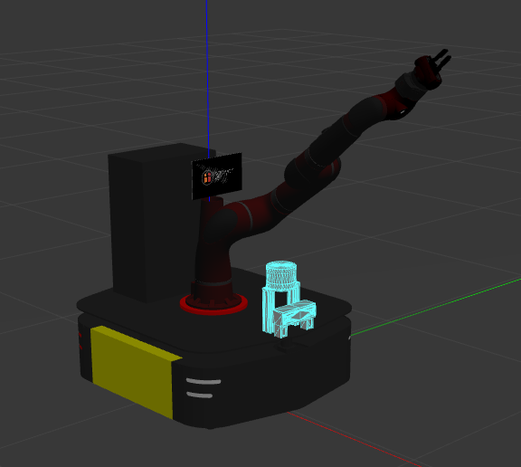
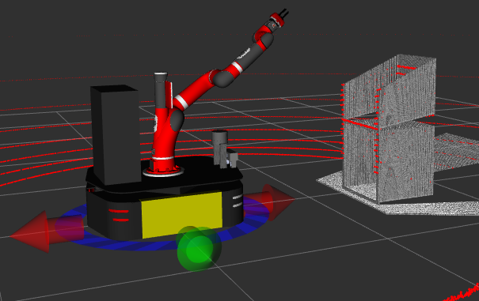

### Author: Boston Cleek
### Date: 5/25/20

# Overview
This package contains the files required for simulating the Sawback in gazebo and in rviz. The Sawback is comprised of both a Ridgeback mobile base and a Sawyer manipulator. The following sensors are includes in the model: Velodyne VLP16 Lidar, 2 Hokoyu Lidars, and Bumblebee2 Stereo Camera. The Sawback is the ruler of the Planet Omicron Persei 8.

# How to run:
The easiest way to get started is to download the rosinstall file or you will need the required packages bellow. In the src/ folder of your workspace run the following:

`wstool init .`  
`wstool merge -t . https://raw.githubusercontent.com/bostoncleek/sawback_description/master/sawback.rosinstall`  
`wstool update -t .`

You may also need to install the `velodyne-gazebo-plugins` package and the `effort_controllers` package.

You will need to modify two files in order for the the Sawback to come to life.

First, in `ridgeback_description` package find the `ridgeback.gazebo` file and change line 5 to read `<robotNamespace>/ridgeback</robotNamespace>`

Second, in the `sawyer_description` package find the `sawyer_base.urdf.xacro` file and change line 5 to read `<material name="sawyer_black">`. You can call the material name anything other than black, you can call it potato if you want.

To vizualize the sawback in rviz:  
`roslaunch sawback_description view_sawback.launch`

To simulate the sawback in gazebo:  
`roslaunch sawback_description sawback_world.launch`

To do both:  
`roslaunch sawback_description sawback_world.launch launch_rviz:=true`

# Required Packages
1) velodyne-gazebo-plugins  
2) effort_controllers  
3) ridgeback_control  
4) ridgeback_description  
5) sawyer_description  
6) sawyer_gazebo

# Known Issues
There is a race condition when spawning a urdf with initial joint angles using the `-J` arg in gazebo. The workaround is that gazabo must be paused during startup and the `-unpause` arg must be passed to the `spawn_model` node. See [spawn_model -J initial joint positions not working #93](https://github.com/ros-simulation/gazebo_ros_pkgs/issues/93) for more information.

# The Sawback

  
  

